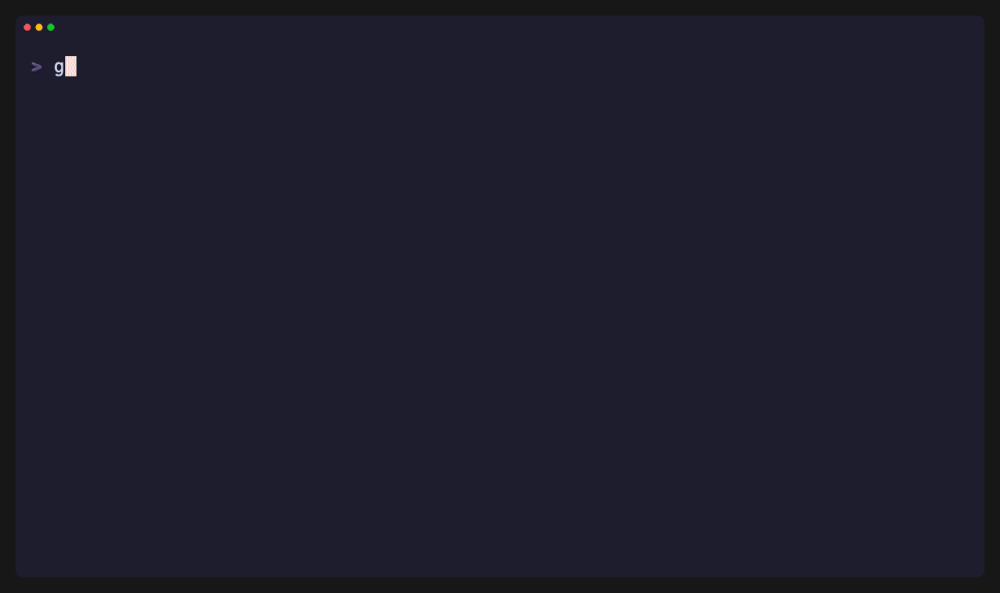
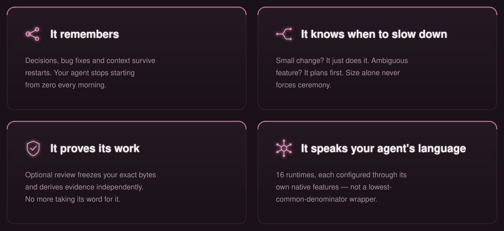
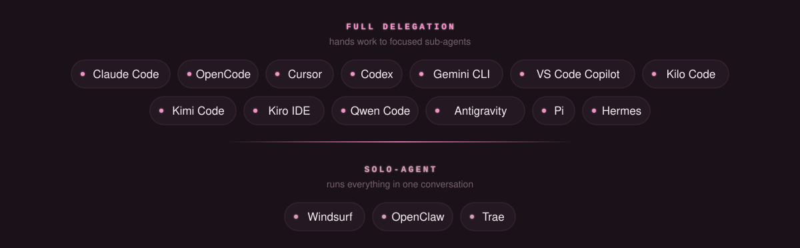

<!-- markdownlint-disable-next-line MD041 -->
<a id="top"></a>

<div align="center">


<h1>Gentle-AI™</h1>

### Your AI agent forgets everything. This fixes that.

<p><strong>One command turns the coding agent you already use into a configured engineering environment.</strong><br/>
Persistent memory. Real process. Evidence instead of promises.</p>

<p>
<a href="https://github.com/Gentleman-Programming/gentle-ai/releases"></a>
<a href="LICENSE"></a>


</p>

<!--
  DEMO SLOT — drop a TUI recording at docs/assets/brand/tui-demo.gif and
  uncomment the line below. Suggested capture: launching `gentle-ai`,
  selecting agents, picking a preset, and the final `gentle-ai doctor` report.

  
-->

<br/>

```bash
curl -fsSL https://raw.githubusercontent.com/Gentleman-Programming/gentle-ai/main/scripts/install.sh | bash
gentle-ai
```

<p>
<a href="docs/install.md"></a>
<a href="https://gentle-ai-wiki.gentlemanprogramming.com/"></a>
<a href="#documentation"></a>
<a href="https://gentlemanprogramming.com/"></a>
</p>

</div>

<div align="center">

<picture>
  <source media="(prefers-color-scheme: dark)" srcset="docs/assets/brand/divider-dark.svg" />
  <source media="(prefers-color-scheme: light)" srcset="docs/assets/brand/divider-light.svg" />
  
</picture>

</div>

<div align="center">

### You installed an AI agent. You got a chatbot that writes code.

It forgets your decisions between sessions. It has no opinion about how your project works. And when it says *"done, tests pass"*, your only way to check is reading every line yourself.

</div>

<div align="center">

<picture>
  <source media="(prefers-color-scheme: dark)" srcset="docs/assets/brand/features-dark.svg" />
  <source media="(prefers-color-scheme: light)" srcset="docs/assets/brand/features-light.svg" />
  
</picture>

</div>

<div align="center">

<sub>Memory · Skills · Persona · Spec-Driven Development · Live docs · Guardrails · Model routing · Themes</sub>

<sub>**[→ See everything you get](docs/components.md)**</sub>

</div>

<div align="center">

<picture>
  <source media="(prefers-color-scheme: dark)" srcset="docs/assets/brand/divider-dark.svg" />
  <source media="(prefers-color-scheme: light)" srcset="docs/assets/brand/divider-light.svg" />
  
</picture>

</div>

<div align="center">

## Works with what you already have

<picture>
  <source media="(prefers-color-scheme: dark)" srcset="docs/assets/brand/agents-dark.svg" />
  <source media="(prefers-color-scheme: light)" srcset="docs/assets/brand/agents-light.svg" />
  
</picture>

<sub>**[→ Full feature matrix](docs/agents.md)**</sub>

<br/>

> [!IMPORTANT]
> **Gentle-AI never installs an AI agent for you.** It configures runtimes already on your machine. If it cannot detect the one you picked, it refuses and prints the command you'd run yourself.

</div>

<div align="center">

<picture>
  <source media="(prefers-color-scheme: dark)" srcset="docs/assets/brand/divider-dark.svg" />
  <source media="(prefers-color-scheme: light)" srcset="docs/assets/brand/divider-light.svg" />
  
</picture>

</div>

<div align="center">

<!--
  sealed_token is a GitHub fine-grained token encrypted against Star History's
  public key, so only the encrypted value is published here. It is required
  because GitHub restricted the stargazers API to a repository's admins and
  collaborators on 2026-06-30; without it the chart renders an error placeholder.
  Regenerate it at https://www.star-history.com/?repos=Gentleman-Programming%2Fgentle-ai&type=date&legend=top-left
-->

<a href="https://www.star-history.com/?repos=Gentleman-Programming%2Fgentle-ai&type=date&legend=top-left">
  <picture>
    <source media="(prefers-color-scheme: dark)" srcset="https://api.star-history.com/chart?repos=Gentleman-Programming%2Fgentle-ai&type=date&theme=dark&legend=top-left&sealed_token=zwrd_DfwYZeJU7nhGYNtREEheKWYEslW_uzrqORlZ36v-JSMepdqGLkKExp1M-xbNq6t-ebVS5iM3WoPDO26tXbSGkjXC2Jo3kHQ3uNzlRkCrWoqRHkPVQXvosKciY109ObiwGV1z8aajyedcloppmekCGrvVKJb6KWxGLXW_mHcRAVIBZUOa4SzW75D" />
    <source media="(prefers-color-scheme: light)" srcset="https://api.star-history.com/chart?repos=Gentleman-Programming%2Fgentle-ai&type=date&legend=top-left&sealed_token=zwrd_DfwYZeJU7nhGYNtREEheKWYEslW_uzrqORlZ36v-JSMepdqGLkKExp1M-xbNq6t-ebVS5iM3WoPDO26tXbSGkjXC2Jo3kHQ3uNzlRkCrWoqRHkPVQXvosKciY109ObiwGV1z8aajyedcloppmekCGrvVKJb6KWxGLXW_mHcRAVIBZUOa4SzW75D" />
    
  </picture>
</a>

</div>

<div align="center">

<picture>
  <source media="(prefers-color-scheme: dark)" srcset="docs/assets/brand/divider-dark.svg" />
  <source media="(prefers-color-scheme: light)" srcset="docs/assets/brand/divider-light.svg" />
  
</picture>

</div>

## Documentation

| I want to… | Read |
| --- | --- |
| **Install it** | **[Install](docs/install.md)** · [Quickstart](docs/quickstart.md) · [Platforms](docs/platforms.md) |
| Understand the mental model | [Intended Usage](docs/intended-usage.md) |
| Know when my agent plans vs. just codes | [Organic Implementation Routing](docs/trigger-rules.md) |
| Plan substantial work with SDD | [Intended Usage](docs/intended-usage.md) · [OpenSpec Config](docs/openspec-config.md) |
| See what each component does | [Components, Skills & Presets](docs/components.md) |
| Configure a specific agent | [Agents](docs/agents.md) · [Pi](docs/pi.md) · [OpenCode Profiles](docs/opencode-profiles.md) |
| Get evidence instead of promises | [Organic RDD](docs/architecture/organic-rdd.md) · [Review Contract](docs/review-integration.md) · [Threat Model](docs/review-authority-threat-model.md) |
| Find or share persistent context | [Engram Commands](docs/engram.md) |
| Update, restore or troubleshoot | [Usage](docs/usage.md) · [Backup & Rollback](docs/rollback.md) |
| Verify a release signature | [Release signing](docs/release-signing.md) |
| Contribute | [Community Roadmap](docs/community-roadmap.md) · [Contributing](CONTRIBUTING.md) · [Codebase Guide](docs/CODEBASE-GUIDE.md) |
| Opt out of usage telemetry | [Telemetry](docs/telemetry.md) |

<div align="center">

<picture>
  <source media="(prefers-color-scheme: dark)" srcset="docs/assets/brand/divider-dark.svg" />
  <source media="(prefers-color-scheme: light)" srcset="docs/assets/brand/divider-light.svg" />
  
</picture>

</div>

<div align="center">

## Built by the community

Everything labelled [`up-for-grabs`](https://github.com/Gentleman-Programming/gentle-ai/issues?q=is%3Aissue+is%3Aopen+label%3Aup-for-grabs) is scoped, approved and unclaimed. Start at the **[Community Roadmap](docs/community-roadmap.md)**.

<a href="https://github.com/Gentleman-Programming/gentle-ai/graphs/contributors">
  
</a>

<br/><br/>

Maintained by **[Alan Buscaglia](https://github.com/Gentleman-Programming)** — Gentleman Programming.<br/>
15 years of enterprise architecture, one rule for AI-assisted work: **verifying beats generating.**

<a href="https://gentlemanprogramming.com/">Website</a> &bull;
<a href="https://www.youtube.com/@GentlemanProgramming">YouTube</a> &bull;
<a href="mailto:gentleman@ohmybitz.com">Email</a> &bull;
<a href="docs/consulting.md">Consulting for teams</a>

<br/>


</div>

<sub><strong>Trademark notice:</strong> The Gentle AI™ and Engram™ names and logos are trademarks of Alan Buscaglia. Both marks are used throughout this document; the symbol appears on the first prominent mention of each, and this notice covers the rest. The MIT License applies to the code; it does not permit implying endorsement or official affiliation. See <a href="TRADEMARKS.md">TRADEMARKS.md</a>.</sub>
