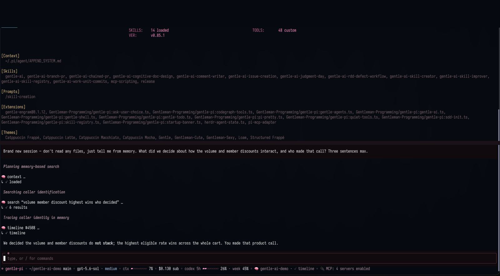
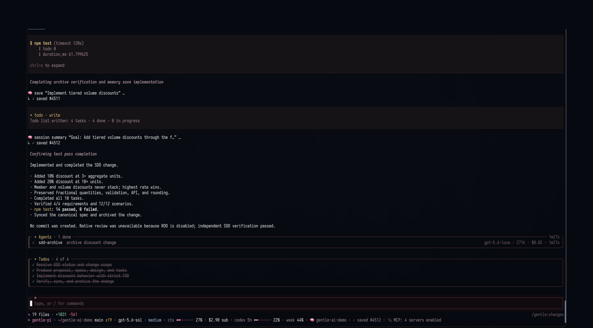
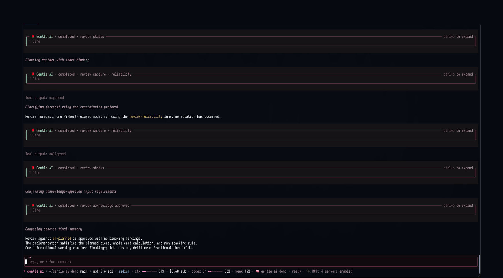
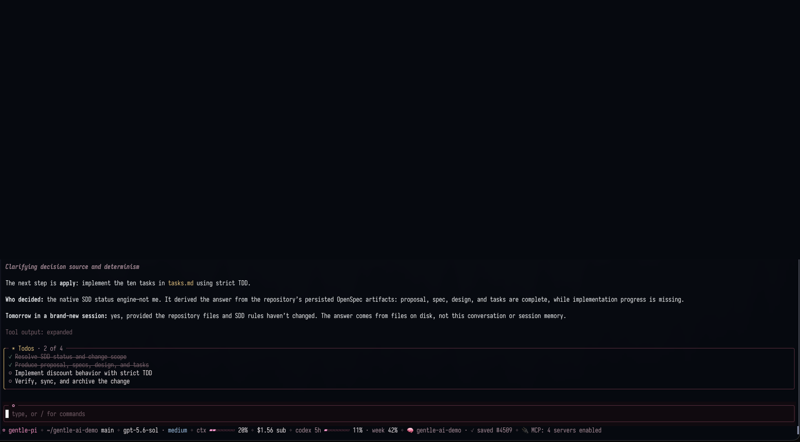
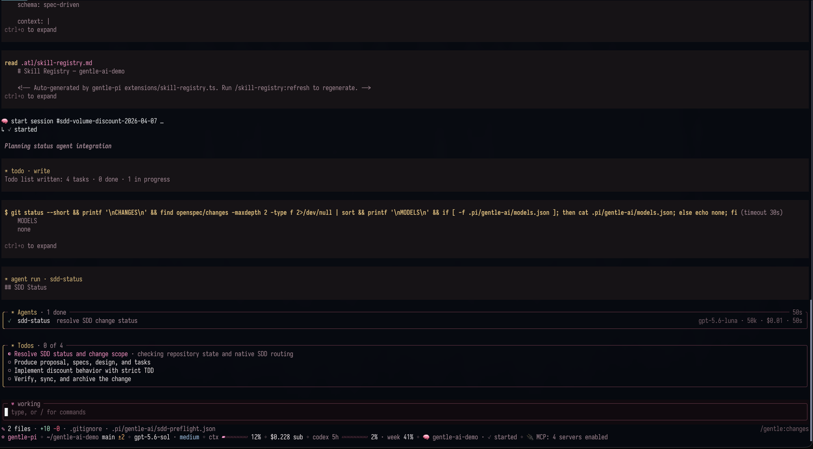

<!-- markdownlint-disable-next-line MD041 -->
<a id="top"></a>

<div align="center">


<h1>Gentle-AI™</h1>

<p><strong>The deterministic engineering environment for the AI agent you already use.</strong></p>

<p>
<a href="https://github.com/Gentleman-Programming/gentle-ai/releases"></a>
<a href="https://github.com/Gentleman-Programming/gentle-ai/stargazers"></a>


<a href="LICENSE"></a>
</p>

<p>
<a href="https://gentlemanprogramming.com/"><strong>Website</strong></a> &bull;
<a href="docs/quickstart.md"><strong>Quickstart</strong></a> &bull;
<a href="docs/intended-usage.md"><strong>Docs</strong></a> &bull;
<a href="https://gentle-ai-wiki.gentlemanprogramming.com/"><strong>Wiki</strong></a>
</p>

<br/>

<p>
Your agent writes code, then forgets everything. It has no opinion about your project,
and no way to prove what it did beyond asking you to read every line.
<strong>Gentle-AI gives it memory, a workflow, and evidence.</strong>
</p>

<br/>

<!--
  HERO SLOT — the only animation on this page. The six Features images are stills,
  so motion is spent once, here, right after the pitch lands.

  Uncomment when docs/assets/features/hero-pi.gif exists. It is a real-time capture
  of the complete Pi startup: banner, extensions, skills and startup output, never
  trimmed. A stripped startup does not look like the real thing.


<br/>
-->

<sub><strong>If Gentle-AI made your agent worth trusting, a star helps other people find it.</strong></sub>

<!--
  sealed_token is a GitHub fine-grained token encrypted against Star History's
  public key, so only the encrypted value is published here. It is required
  because GitHub restricted the stargazers API to a repository's admins and
  collaborators on 2026-06-30; without it the chart renders an error placeholder.
  Regenerate it at https://www.star-history.com/?repos=Gentleman-Programming%2Fgentle-ai&type=date&legend=top-left
-->

<a href="https://www.star-history.com/?repos=Gentleman-Programming%2Fgentle-ai&type=date&legend=top-left">
  <picture>
    <source media="(prefers-color-scheme: dark)" srcset="https://api.star-history.com/chart?repos=Gentleman-Programming%2Fgentle-ai&type=date&theme=dark&legend=top-left&sealed_token=zwrd_DfwYZeJU7nhGYNtREEheKWYEslW_uzrqORlZ36v-JSMepdqGLkKExp1M-xbNq6t-ebVS5iM3WoPDO26tXbSGkjXC2Jo3kHQ3uNzlRkCrWoqRHkPVQXvosKciY109ObiwGV1z8aajyedcloppmekCGrvVKJb6KWxGLXW_mHcRAVIBZUOa4SzW75D" />
    <source media="(prefers-color-scheme: light)" srcset="https://api.star-history.com/chart?repos=Gentleman-Programming%2Fgentle-ai&type=date&legend=top-left&sealed_token=zwrd_DfwYZeJU7nhGYNtREEheKWYEslW_uzrqORlZ36v-JSMepdqGLkKExp1M-xbNq6t-ebVS5iM3WoPDO26tXbSGkjXC2Jo3kHQ3uNzlRkCrWoqRHkPVQXvosKciY109ObiwGV1z8aajyedcloppmekCGrvVKJb6KWxGLXW_mHcRAVIBZUOa4SzW75D" />
    
  </picture>
</a>

<br/>

<sub><strong>WORKS WITH THE AGENT YOU ALREADY HAVE</strong></sub>


</div>

<div align="center"></div>

## Features

<table>
<tr>
<td width="50%" valign="top">

### Engram™ — memory that persists

Decisions, bug fixes and conventions survive sessions, restarts and compaction. Your agent stops starting from zero every morning.

**[Docs →](docs/engram.md)**



</td>
<td width="50%" valign="top">

### SDD — spec-driven, our way

Research → Spec → Design → Tasks → strict TDD → **Verify**. An independent phase audits the RED/GREEN trail, so the agent never grades its own homework.

**[Docs →](docs/intended-usage.md)**



</td>
</tr>
<tr>
<td width="50%" valign="top">

### RDD — we created it

Receipt-Driven Development. The system freezes the exact bytes your agent changed and derives the evidence itself. Zero ceremony on a README. Four reviewers on two lines of auth code. Opt-in, off until you turn it on.

**[Docs →](docs/review-integration.md)**



</td>
<td width="50%" valign="top">

### Deterministic by design

SDD and RDD live in the **`gentle-ai` binary**, not in prompt prose a model can reinterpret. Go freezes the candidate and returns the exact next command; the agent runs it verbatim.

**[Docs →](docs/trigger-rules.md)**



</td>
</tr>
<tr>
<td width="50%" valign="top">

### Gentle-Shell

Our interface for Pi. Context and spend as live gauges, <kbd>alt+g</kbd> for a working-tree diff overlay against HEAD, `/gentle:usage` for the provider windows you have left.

**[Docs →](docs/pi.md)**



</td>
<td width="50%" valign="top">

### 16 agents, one behavior

Claude Code, Codex, Cursor, OpenCode, Copilot, Gemini and ten more — each configured through **its own native features**. Twelve delegate to focused sub-agents; four run solo. Same workflow on all of them.

**[Docs →](docs/agents.md)**


</td>
</tr>
</table>

### Also in the box

| Component | What it does |
| :--- | :--- |
| **Skills library** | Loaded automatically when the task matches |
| **Context7 MCP** | Live framework and library documentation |
| **CodeGraph** | Read-only symbol graph of your codebase |
| **Security deny-list** | Blocks `~/.ssh`, `.env` and credential files |
| **Config backups** | Snapshotted before every single write |
| **Doctor** | `gentle-ai doctor` — read-only health report |
| **Personas** | Gentleman, neutral, or a voice of your own |
| **Themes** | Gentleman and Gentleman-Cute |
| **Provider switcher** | Swap AI providers on the fly |
| **OpenCode profiles** | A different model for each SDD phase |

> **Every component, skill and preset: [Full breakdown →](docs/components.md)**

<div align="right"><a href="#top">Back to top</a></div>

<div align="center"></div>

## Get started

```bash
# macOS / Linux
curl -fsSL https://raw.githubusercontent.com/Gentleman-Programming/gentle-ai/main/scripts/install.sh | bash

# Windows (PowerShell) — source install, needs Go 1.25.10+
go install github.com/gentleman-programming/gentle-ai/v2/cmd/gentle-ai@latest
```

```bash
gentle-ai          # pick your agents, components and persona
gentle-ai doctor   # verify — read-only, changes nothing
```

Then use your agent normally. Your configs are snapshotted before every write, and **Gentle-AI never installs an AI agent for you** — it configures what you already have.

> **Homebrew, beta channel, signature verification and per-distro prerequisites: [Quickstart →](docs/quickstart.md)**

<div align="right"><a href="#top">Back to top</a></div>

<div align="center"></div>

## Documentation

| Where to go | What you'll find |
| :--- | :--- |
| **[Intended Usage](docs/intended-usage.md)** | The mental model. If you read one page, read this one. |
| **[Quickstart](docs/quickstart.md)** · **[Usage](docs/usage.md)** | Install, prerequisites, every CLI command and flag |
| **[Agents](docs/agents.md)** | Feature matrix and per-agent notes for all 16 |
| **[Routing](docs/trigger-rules.md)** | How the agent picks direct, delegated or SDD |
| **[Review](docs/review-integration.md)** · **[Architecture](docs/architecture/organic-rdd.md)** | The RDD contract, lifecycle and threat model |
| **[Engram](docs/engram.md)** · **[Components](docs/components.md)** | Memory commands, skills, presets and personas |
| **[Contributing](CONTRIBUTING.md)** · **[Codebase Guide](docs/CODEBASE-GUIDE.md)** | Extend or contribute |
| **[Telemetry](docs/telemetry.md)** | What we count, and how to turn it off |

<div align="right"><a href="#top">Back to top</a></div>

<div align="center"></div>

## Community

Everything labelled [`up-for-grabs`](https://github.com/Gentleman-Programming/gentle-ai/issues?q=is%3Aissue+is%3Aopen+label%3Aup-for-grabs) is scoped, approved and unclaimed — pick one and it's yours.

<div align="center">

<a href="docs/community-roadmap.md"></a>
<a href="CONTRIBUTING.md"></a>
<a href="CONTRIBUTORS.md"></a>

<br/><br/>

<a href="CONTRIBUTORS.md">
  
</a>

<p><sub>This project exists because of these people.</sub></p>

</div>

<div align="right"><a href="#top">Back to top</a></div>

<div align="center"></div>

## About the author

Built by [Alan Buscaglia](https://github.com/Gentleman-Programming) (Gentleman Programming): 15 years of enterprise architecture, a community of thousands of developers testing these tools daily, and one rule for AI-assisted work — **verifying beats generating**.

Teams adopting AI and finding it isn't working — resistance, everyone prompting their own way, no shared quality bar — can reach out about engagements built on these same open-source tools.

<div align="center">

<a href="https://gentlemanprogramming.com/"></a>
<a href="https://www.youtube.com/@GentlemanProgramming"></a>
<a href="https://github.com/Gentleman-Programming"></a>
<a href="mailto:gentleman@ohmybitz.com"></a>

</div>

---

<div align="center">


<br/>

<h3>Gentle-AI is crafted with Gentle-AI</h3>

<br/><br/>

<a href="LICENSE"></a>

</div>

> **Trademark notice:** The Gentle AI™ and Engram™ names and logos are trademarks of Alan Buscaglia. Both marks are used throughout this document; the symbol appears on the first prominent mention of each, and this notice covers the rest. The MIT License applies to the code; it does not permit implying endorsement or official affiliation. See [TRADEMARKS.md](TRADEMARKS.md).
